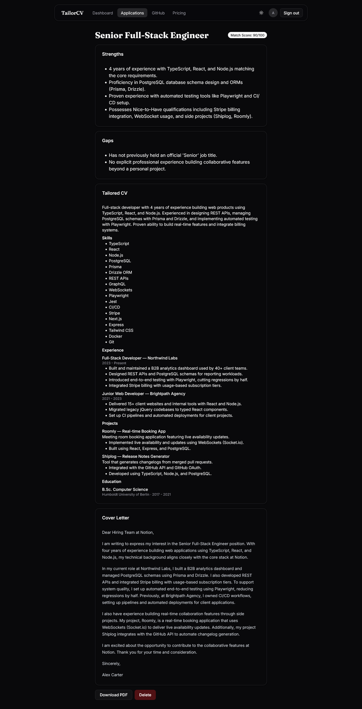

# TailorCV

TailorCV helps you adapt a master CV for a specific job post. It gives you a match score, points out strengths and gaps, then creates a tailored CV and cover letter based on your own CV and GitHub projects.

Live: https://tailorcv-jvnn.onrender.com

## What it does

- Write a master CV once, in markdown.
- Paste a job posting and get a 0-100 match score, matching strengths, and gaps to improve.
- Get a tailored CV (reordered and emphasized for that role) and a cover letter, both exportable to PDF.
- Import public GitHub repos and turn real projects into CV bullet points.
- Free plan: 3 tailored CVs per day. Pro plan: unlimited, via Stripe.

## Screenshots





## Stack

TanStack Start (SSR) with React 19, TanStack Router / Query / Form, Tailwind 4 and shadcn/ui, Better Auth, Drizzle ORM on Postgres (Neon), Gemini for the AI step, `@react-pdf/renderer` for PDFs, and Stripe for subscriptions.

## How it works

The AI part runs on the server with a TanStack Start server function. It sends the master CV and job post to Gemini with a fixed response schema, then validates the response with Zod before saving it. The saved structured result is used for both the screen view and the PDF export.

GitHub repos are pulled from the public API and turned into draft bullet points. The user can review and edit them before adding them to the master CV. Upgrades go through Stripe Checkout, and the webhook updates the user's plan after payment or cancellation.

## Run locally

```bash
pnpm install
pnpm dev
```

Open http://localhost:3000.

To receive Stripe webhooks during development:

```bash
pnpm stripe:listen
```

## Environment

Copy `.env.example` to `.env.local` and fill in:

| Variable | Purpose |
| --- | --- |
| `DATABASE_URL` | Neon Postgres pooled connection string |
| `BETTER_AUTH_URL` | App base URL (`http://localhost:3000` in dev) |
| `BETTER_AUTH_SECRET` | Auth secret — `pnpm dlx @better-auth/cli secret` |
| `GEMINI_API_KEY` | Google AI Studio key |
| `STRIPE_SECRET_KEY` | Stripe secret key (test mode) |
| `STRIPE_PRICE_ID` | Recurring price id for the Pro plan |
| `STRIPE_WEBHOOK_SECRET` | Webhook signing secret (`whsec_...`) |

## Tests

```bash
pnpm test
```

## Notes

- Gemini returns structured data, and the app validates it with Zod before saving.
- The daily free limit is stored in Postgres. I avoided adding Redis because the project does not need it yet.
- The app is deployed in a US region because Gemini free API access can fail from some datacenter regions.
